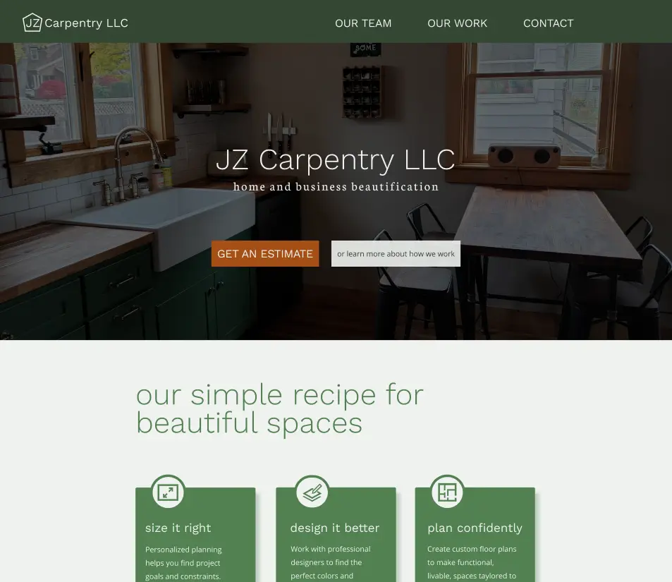

# Website for Vermont based company JZ Carpentry

<div align="left" margin="10rem">

</div>

- will be deployed at [jzcarpentryvt.com](https://jzcarpentryvt.com)

## Project goal

- To replace a poorly designed wordpress site.
- Clean, mobile friendly design to drive business engagement.
- Accessibility for A11y friendly design including use of screen reader.
- limit use of frameworks and modules to master core HTML, CSS, and JS skills.

## Tools used

- prototyped with Figma: [JZ Carpentry Prototype](https://www.figma.com/file/ETWAvlJzF8x60tOen8LSKq/JZ-carpentry?node-id=496%3A170)

- I used feature branches and Pull Requests for build stability: [Link to example PR]
- npm package management.
- wicg-inert for out of focus content.
- bigPicture for a simple, mobile friendly picture gallery.
- lozad for lazy image loading.
- eslint, stylelint and prettier for code formatting.
- parcel for bundling and build deployment
- deployments through netlify actions (https://happy-albattani-62afb4.netlify.app/).

## How to navigate this project

- Simple project structure: src deploys to build to netlify build.
- images currently hosted on Github in src folder with plans to move either to AWS, Netlify or other third party hosting sight.

## Why I built the project this way

- wicg-inert was the first package installed through NPM. It provides a clean way to disallow page element focus when elements such as the nave menu or gallery are in use.

- The project gallery was designed as a fluid CSS Grid. I decided I did not wish to predefine or scale image sizes. BigPicture was chosen as a simple gallery display tool for its ease of implimentation and its lack of requirement for presized images.

- Parcel-bundler as added to compile node modules for deployment. It was chosen for its build speed and simple setup process compared to bundlers such as webpack. Initially I imported images statically due to Parcel-bundler's incompatiblity with bigPicture's use of a custom attribute `data-bp` for img urls. Parcel was later upgraded to version 2 for node compatibility.

- While testing Parcel 2 to remain compatible with current node versions, I found moritzlaube's Parcel 2 plugin [parcel-transformer-html-datasrc] (https://github.com/moritzlaube/parcel-transformer-html-datasrc) that appeared to use the correct underlying structure I needed to support bigPicture's `data-bp` attributes. Reading parcel docs, I was able to contribute custom options support for moritzlaube's plugin that allowed for out of box support for bigPicture.

- Lozad was chosen to handle lazy image loading of the gallery page to help with SEO and first impactful draws of sight as well as potentially reducing total network usage. Because of my work on the Parcel plugin [parcel-transformer-html-datasrc], lozad's custom data attributes also were seemlessly compatible with the parcel build process.

<!-- - Testing is an essential part of production applications. Testing Library is the go-to library in the
  React community. I covered the essential features of the app with tests. -->

## If I had more time I would change this

- Set up continuous integration to run the tests and ESLint on every Pull Request
- Refactor some of the code. Especially this part [link to code on GitHub]
- Add backend support for client handling of gallery images including add and delete actions.
- Support file uploads for the contact page while minimizing client costs. netlify costs $19 per month for this form feature and the cost does not currently justify client needs.
- Some work was done building this system through Serverless deployment of AWS signed post uploads and SES notifications but I chose to put this on hold due to the client not strictly requiring file uploads.

## Available Scripts

To serve local builds run:

```bash
    npm run start
```

To build deployment as currently run by Netlify actions run:

```bash
    npm run start
```
